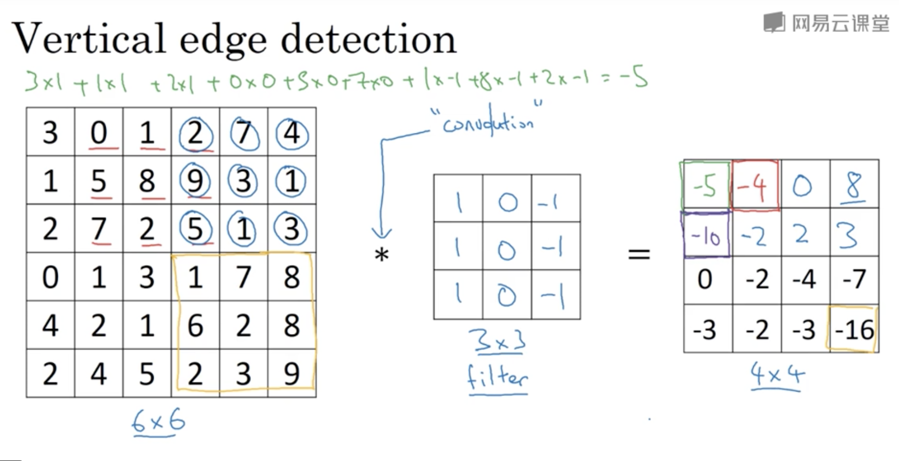
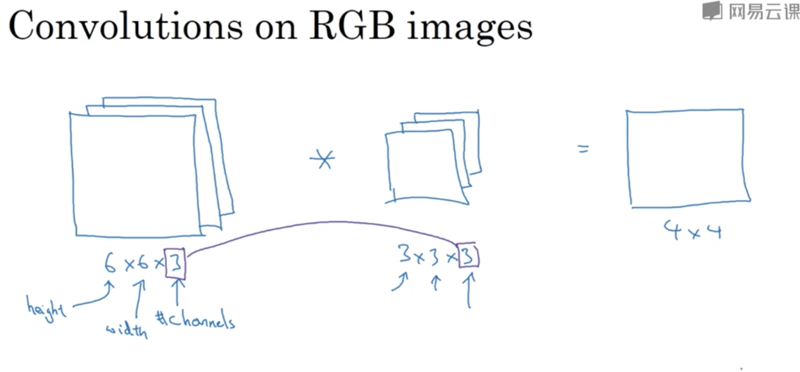
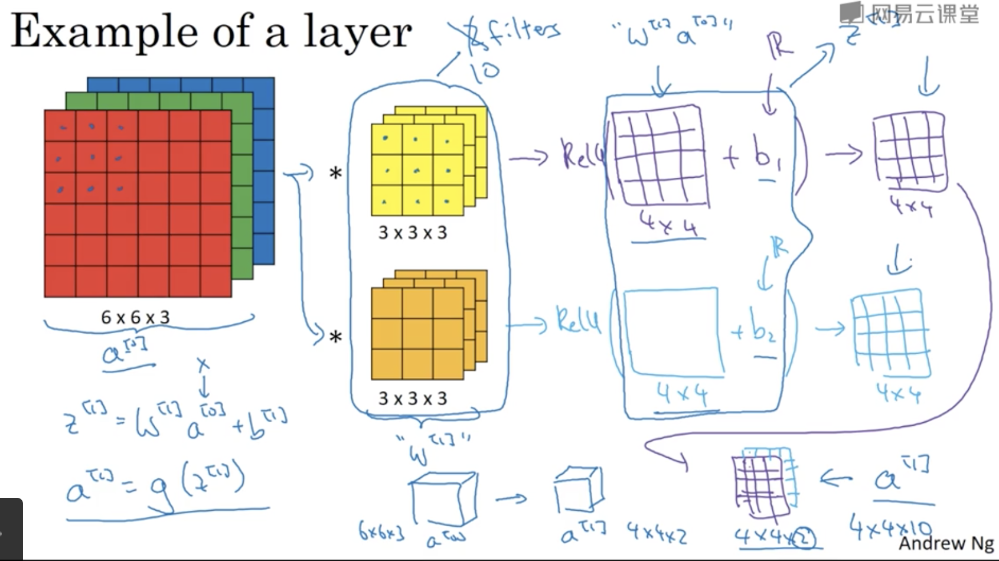

## 第一周 卷积神经网络

### 1.2边缘检测示例

6 * 6 经过 3 * 3 的过滤生成4 * 4的矩阵

左边的图像中间有一条分明的轮廓线，经过3 * 3矩阵的卷积后，得到了一个中间是检测出中间垂直边缘的4 * 4图像矩阵（卷积出来的边缘很宽是因为原图像非常小 只有6 * 6）

### 1.3 更多边缘检测内容

使用不同的过滤器（就是不同的卷积核，可以检测出不同的图像边缘）

### 1.4 Padding

卷积得到的图片大小应该是 (n - f + 1) * (n - f + 1)， 其中n是原图片大小，f是过滤器的大小。

出现了两个问题：

1. 图像会随着卷积的深度不断缩小
2. 图像边缘的像素使用率很低

为了解决这两个问题，可以在原图像上做填充，一般会在图像四周填充0像素。

对于填充像素数量的多少，可以按如下方式进行决定

1. Valid 卷积
2. Same 卷积

Valid 卷积实际上并不对图像进行任何填充

Same 卷积是使卷积前和卷积后的图片大小一样

(n + 2p - f + 1) * (n + 2p -f + 1) 其中p是填充像素的数量，经过简单的运算可知，当p = （f - 1） / 2 的时候，可以达到目的。

在cv中，f 通常会是一个奇数。

### 1.5卷积步长

即过滤器每次移动的距离。

当卷积过程的参数如下时：
$$
n\quad原图像大小\\
f\quad过滤器大小\\
p\quad填充大小\\
s\quad步长大小

$$
卷积后得到的图形矩阵：
$$
(\frac{n + 2p - f}{s} + 1)^2
$$
如果上不是一个整数，向下取整。

### 1.6在三通道图像上实行卷积

图像的通道数和卷积核的通道数需要一致。

三个维度分别是 Height Width Channels
$$
n * n * n_c 经过 f * f * n_c卷积后得到(n - f + 1) * (n - f + 1) * n_c'大小的结果\\
其中n_c'表示所有卷积核的数目
$$

### 1.7单层卷积网络

原图像经过卷积核，得到一个输出矩阵，输出矩阵每个元素都加上偏执bias后，经过非线性激活函数，得到神经网络的第一层。（就是前向传播的过程）

注意bias是一个标量，但是要被一开始卷积出来的矩阵中的所有元素相加。

